# Hotdog Empire Tycoon


## Live Site

[Hotdog Empire Tycoon](
  https://dashboard.heroku.com/apps/hotdog-empire-tycoon/)

## Repository

[https://github.com/BobWritesCode/ci-Project3](
  https://github.com/BobWritesCode/ci-Project3)

---

## Table of Contents

- [Hotdog Empire Tycoon](#hotdog-empire-tycoon)
  - [Live Site](#live-site)
  - [Repository](#repository)
  - [Table of Contents](#table-of-contents)
  - [Objective](#objective)
  - [Brief](#brief)
    - [Hotdoog Empire Tycoon](#hotdog-empire-tycoon-1)
  - [UX &#8722; User Experience Design](#ux--user-experience-design)
    - [User Requirements](#user-requirements)
      - [First Time User](#first-time-user)
      - [Returning User](#returning-user)
      - [Interested Party](#interested-party)
    - [Initial Concept](#initial-concept)
      - [Wireframes](#wireframes)
        - [Desktop](#desktop)
      - [Colour Scheme](#colour-scheme)
      - [Typography](#typography)
      - [Imagery](#imagery)
  - [Logic](#logic)
    - [Initial Flow](#initial-flow)
    - [Python Logic](#python-logic)
  - [Features](#features)
    - [Existing Features](#existing-features)
      - [UX](#ux))
    - [Features Left to Implement](#features-left-to-implement)
  - [Data Model](#data-model)
  - [Technologies Used](#technologies-used)
    - [Python Packages](#python-packages)
    - [Other Tech](#other-tech)
      - [VSCode Extensions](#vscode-extensions)
  - [Testing](#testing)
    - [Python Testing](#python-testing)
      - [Manual Python Testing](#manual-python-testing)
        - [Manual Testing Documentation](#manual-testing-documentation)
      - [PEP8 Testing](#pep8-testing)
      - [Other Python Testing](#other-python-testing)
    - [W3C Validator](#w3c-validator)
  - [Bugs](#bugs)
    - [Current](#current)
    - [Resolved](#resolved)
  - [Development](#development)
    - [GitHub](#github)
    - [GitPod](#gitpod)
      - [Cloning](#cloning)
      - [Editing](#editing)
    - [Working With Python](#working-with-python)
      - [Packages](#packages)
      - [Debugging](#debugging)
    - [Google Sheets](#google-sheets)
      - [Creating Sheets](#creating-sheets)
      - [API Credentials](#api-credentials)
  - [Deployment](#deployment)
    - [Heroku](#heroku)
  - [Credits](#credits)
    - [Content](#content)
    - [Media](#media)
    - [Acknowledgements](#acknowledgements)

---

## Objective

Design an interactive game that uses an existing API for to save user game data and a leader board.
The project should run in a CLI, deployed via Heroku, using Python.

***The needs within this project are not genuine and are made purely
for the purpose of completing this project.***

---

## Brief

### Hotdog Empire Tycoon

The goal of this site is to provide an interactive game where the user / player can compete for a place on the leader board. The final product should:

- be programmatically error free,
- be written using Python,
- have replayability,
- handle all user input errors gracefully and appropriately,
- give clear instructions regarding use and valid inputs.
---

## UX &#8722; User Experience Design

Some example user stories which will affect the design

#### First Time User

> *"As a person who like likes to play games, I would like something that provides some challenges but not overly difficult to learn."*
>
> *"As a competitive player, I would like to know how I compare with other users and go for top of a leader board."*
>
> *"As someone unfamiliar with tycoon game concept, I would like something that is to pick up and provides adequate direction."*

### Returning User

> *"As a returning user, I would like to see a list of current high-scores."*
>
> *"I would like to be able to continue a game where I left off."*
>
> *"I would the experience to be different each time I play."*

#### Interested Party

> *"As someone interested in how the application has been made, I am interested to see how user inputs have been validated and errors have been handled"*
>
>*"As someone interested in how the application wasm, I am interested to see any interesting code you made have used or created."*

---

### Initial Concept

I intend to make a game application inspired by a childhood memory of Lemonade stand. The version I played was a flash game but learnt from starting this project that it all started with the [original created by Bob Jamison](https://en.wikipedia.org/wiki/Lemonade_Stand).

I intend to:
- use an API to store user game data, which the user can also use to retrieve a previous game they have not completed yet.
- use an API to store a leader board, which users will be able to view.
- write error proof logic.
- a fun and interesting game.

I do not intend:
- to store any user sensitive information using the API.

#### Wireframes

Due to the nature of this project the wireframes are very basic. There is only
one page and the design does not change across any devices, only a change in
content.

##### Desktop

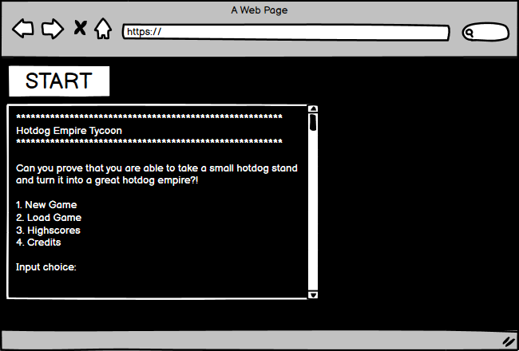

---

#### Colour Scheme

I wanted to go for a vibrant eye-catching look. I also tried to keep to a colour theme as much as possible and not use too many colours.

- Cyan - Used mainly for headers.
- Pink - Used mainly for user tips.
- Orange - Used mainly for when user input was required.
- Red - Used mainly for errors and grabbing user attention.
- Yellow - Used mainly to highlight '0. Go Back' to the user
- Gold - Used mainly to highlight positive information to the user.
- Green - Used mainly for cash balance and some areas to help separate information from each other.

To create the different colour text in the game I used code found of [Grepper](https://www.codegrepper.com/code-examples/python/how+to+color+text+in+python+3).

```python
def colored(r, g, b, text):
    return "\033[38;2;{};{};{}m{} \033[38;2;255;255;255m".format(r, g, b, text)
```

I then created specfic colour functions to have better readability, keep colours uniformed and make it quicker to add coloured text.

```python
def pink(text):
    '''
    Changes to PINK if printed to termail
    '''
    return colored(255, 105, 180, text)
```

---

#### Typography

I do not use any external font outside the terminal except for the button provided by Code Institute to 'RUN PROGRAM'

---

#### Imagery

There is no imagery used for this project.

---

## Logic

### Initial Flow

This chart shows what the user will expereience / see and is the concept of how the game will run

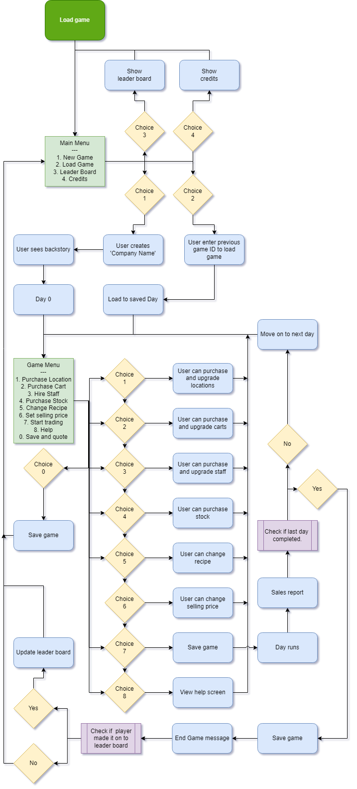

---

### Python Logic

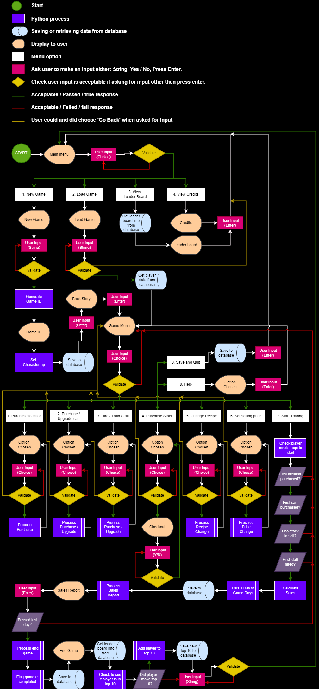

---

## Features

### Existing Features

**Main Menu**

The main menu is the first screen a user will see, and give them 4 options to pink from:
- New game
- Load game
- View leaderboard 
- Credits

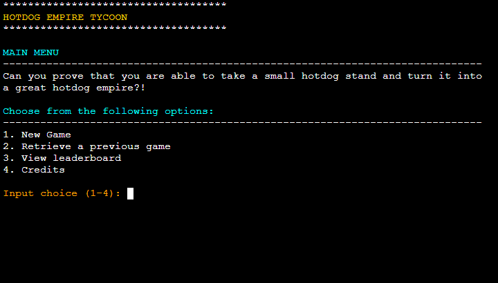

Setting up a new Game

The user will need to provide a new name for their new hotdog empire. This must be from 5 and up to 20 characters.

```python
if len(user_name) < 5 or length > 20:
    print_error_message("Company name must be least 5 and no more "
                        + "than 20 characters")
    continue
```

After a game ID will be created and given to the player. This game ID is important as it will be how the user can retrieve their game save.

```python
while True:
    user_id = "".join(
        string.ascii_uppercase[random.randrange(0, 25)] for x in range(6)
        )
    user_data = SHEET.worksheet('user_data')
    cell_list = user_data.findall(user_id)
    if len(cell_list) == 0:
        break
```
After this the user will be given a short back story that is pulled from `constants.py`

**Game Menu**

The game menu is the main screen a user will interact with while playing the game. The user menu gives the player 9 options to pick from, including:
- Purchase location
- Purchase / upgrade cart(s)
- Hire / upgrade staff
- Purchase stock
- Change recipe
- Set selling prices
- Start trading
- Help
- Save and quit

This menu also provides valuable information to the player, so they don't have to unnecessarily go in and out of menu options to get this information.


- Purchase locations

Here the user can purchase locations they to sell at. Logic is in place so the user has to purchase each location in order.

```python
if (not stats['location'][str(user_choice)]['purchased']
        and purchase_loc_try(stats, int(user_choice))):
    remaining_cash = stats["cash"] - loc_cost[int(user_choice)-1]
elif not purchase_loc_try(stats, int(user_choice)):
    print_error_message('Can not make this purchase yet.')
    continue
else:
    print_error_message('Already Purchased.')
    continue
```

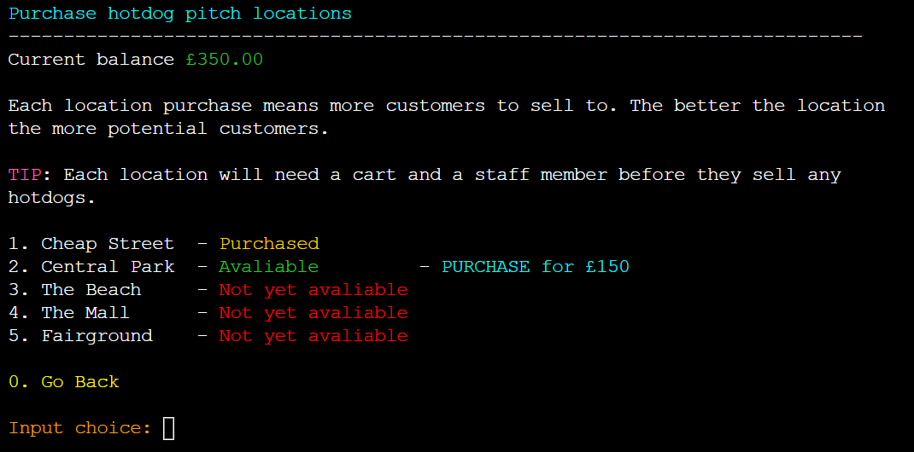

- Purchase / upgrade carts

Within this screen the user can purchase and upgrade carts. Logic is in place so the user can only purchase carts that they have already purchased the location for.

```python
# Make sure location has been purchased first.
if not stats['location'][str(result)]['purchased']:
    print_error_message("Purchase Land")
    continue

# Check if cart is not already at max level.
cart_level = stats['location'][str(result)]['cart_lvl']
if cart_level == 5:
    print_error_message("Already at max level.")
    continue
```

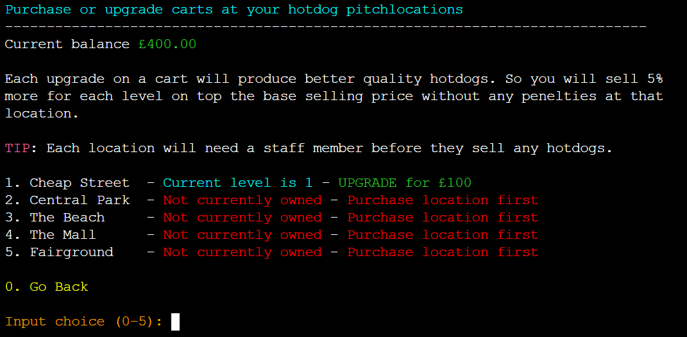

- Hire / train staff

This screen is very similar to purchase / upgrade carts with the same logic to check which options can be purchases and are currently upgradable.

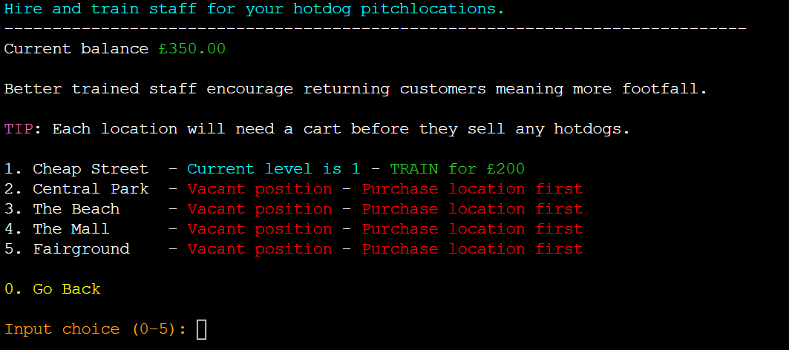

- Purchase stock

The purchase stock screen has 2 stages. Firstly the main screen which shows the user information like how many ingredients they have in stock and how many products that makes based on their current recipe. At this stage the user can currently choose how many products they wish to have in stock ready to sell. If they input a number before the current stock level, logic will work out the amount of products need to be purchased and then show the user a checkout screen.

```python
def get_portions_avaliable(stats):
    '''
    Return how many portions of hotdogs are avaliable to sell
    based on current stock and recipe.
    '''
    # Max portions that can be sold in 1 part of the day
    max_por = 9999999
    # Find out which ingrediant makes the least amount of hotdogs based
    # on recipe.
    for key in constants.STOCK_OPTIONS:
        if stats["recipe"][key] > 0:
            # How many hotdogs this ingredient will make
            ing_max = stats[key] / stats["recipe"][key]
            # Next, see if ing_max is smallest out of all ingredient, mearning
            # max hotdogs
            max_por = ing_max if ing_max < max_por else max_por

    return floor(max_por)
```


```python
# Header
print(f'\n{cyan("Checkout:")}')
print(constants.LINE)
print(f'{"Item:":<23}{"Qty:":<10}{"Portions:":<12}'
      + f'{"Sub total:":<10}')
print(constants.LINE)

# Basket
for count, key in enumerate(constants.STOCK_COSTS):
    text = (basket["portions"][count]
            * basket["total_qty_r"][count])
    text2 = basket["total_qty_c"][count]
    print(f'{constants.STOCK_COSTS[key][0]:<23}'
          + f'{basket["total_qty_r"][count]:<12}'
          + f'{text:<10}'
          + f'£{"{:.2f}".format(text2):<10}')
print(constants.LINE)

# Basket total
print('TOTAL COST: ' + green(f"£{'{:.2f}'.format(cost)}"))
```

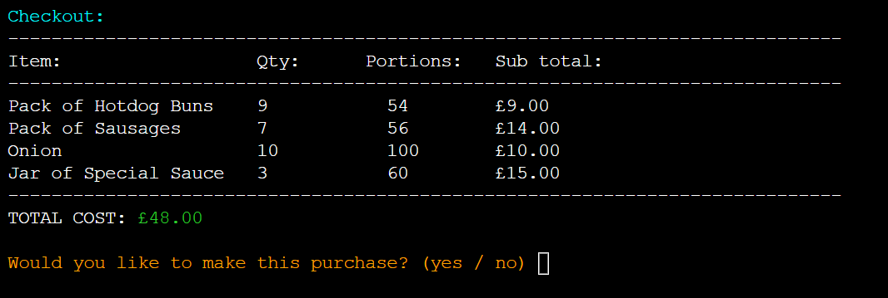

- Change recipe

Within this screen the user can change how many ingredients are used to make each hotdog. It also displays the cost to make each hotdog based on recipe and current recommended retail price (RRP) (cost to make * 3 + 0.5). 

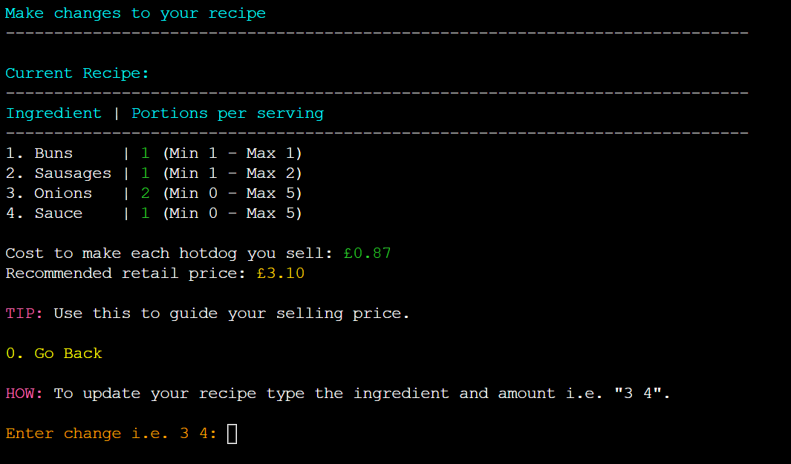

- Set selling price

This is simplest screen in the game. It quite simply allows the user to change the selling price of the product.

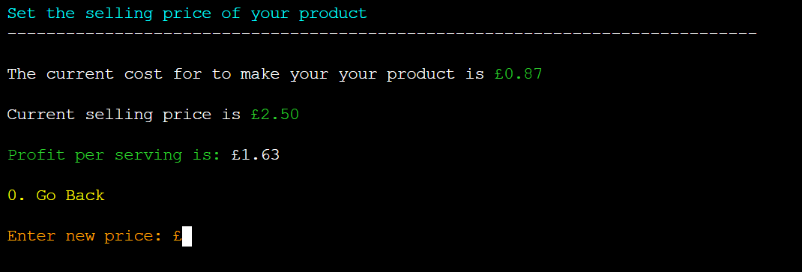

- Help section

To assist the user to understand how to play the game, I have provided this help section. Due to the large blocks of text I have stored them in `constant.py` to avoid blocking up the code in `game_meny.py`.

```python
# Part of help text from constants.py
HELP_SCREEN1 = f"""{cyan('Help:')}
{LINE}
{gold('Main Objective:')} Your main objective is to collect as much wealth
before the final day. At the end your wealth will determine your score.

{pink('Day cycle:')} Every day has 2 parts, morning and afternoon. The
morning starts at 8am and finishes at 12noon, you can do purchases in the
morning and afternoon. The afternoon is from 12noon to 5pm. The afternoon
is slightly longer.
```

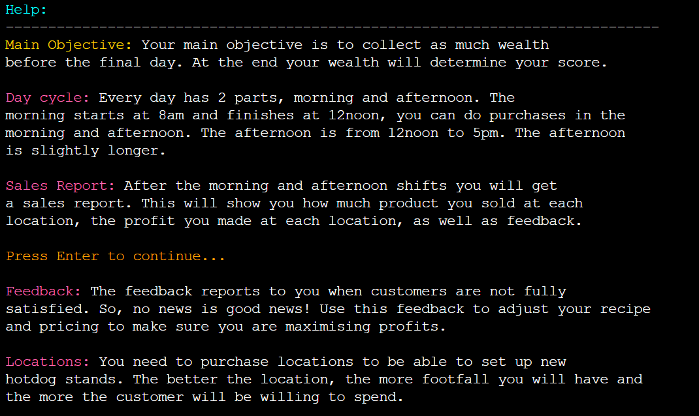

- Save and quit
- Auto save

The game features a save functionality. The user can choose to save at the game menu or the game automatically save at each trading cycle, as well as one last time when the game is completed.

There were a couple obstacles to overcome with the save function. 

1) When saving using `gspread` it does not accept data in a dictionary format. So I had to convert a dictionary to a list. When searching for a solution I was unable myself to come across one. I had to write the code myself. I was able to do this with the solution below.\
\
Simply it takes the dictionary and goes through it key by key appending a blank table.\
\
If the next entry is a dictionary within the dictionary it sends that through a new thread of the function. And repeats that unto it reaches a non dictionary key.\
\
It then returns to the original thread and moves on to the next key.\
\
This repeated until the dictionary has been fully completed.

```python
def convert_dict_to_array(data, data_to_save):
    '''
    Convert dict game data to an array so it can be saved to Google Sheet
    '''
    for key in data:
        if isinstance(data[f'{key}'], dict):
            # If key is a dict then loop function
            convert_dict_to_array(data[f'{key}'], data_to_save)
        else:
            # If key is not a fict then append to table.
            data_to_save.append([data[f"{key}"]])

    return data_to_save
```

2) When saving to a worksheet using `gspread`, saving to a row you can just use a number. But saving to a column you have to use letter notation. I was going to write the code myself but then thought there is a chance someone else has already done this and I can find the code online, which I did.\
\
CREDIT : https://stackoverflow.com/questions/23861680/convert-spreadsheet-number-to-column-letter

```python
def save_loop(col, data, worksheet):
    '''
    Saves data[] to the correct row in Google.
    '''
    # Coverts column number into letter notation used in spreadsheets
    # for columns. Example: 26 = Z, 27 = AA, 28 = AB...
    column_int = int(col)
    start_index = 1
    letter = ''
    while column_int > 25 + start_index:
        letter += chr(65 + int((column_int-start_index)/26) - 1)
        column_int = column_int - (int((column_int-start_index)/26))*26
    letter += chr(65 - start_index + (int(column_int)))

    # Creates string for cell notation for spreadsheet.
    s_col = f'user_data!{letter}1'

    # Saves data to worksheet
    SHEET.values_update(s_col,
                        params={'valueInputOption': 'RAW'},
                        body={'values': data})

    return True
```

- Retrieve game

As the game allows the user to save their game and provides then a Game ID. The user is able to retrieve their game providing it has not already been completed.

```python
# Cycle through row values until Game ID finds a match.
for count, key in enumerate(row_array):
    if key != user_input:
        continue

    # Copy data from column where Game ID found match.
    data = worksheet.col_values(count + 1)

    # Run function set_up_character()
    # Converts data retrieved from worksheet into data format
    # game uses.
    stats = set_up_character(data, False)
```

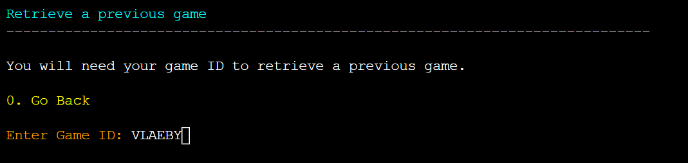

- View leader board


- Being added to leaderboard
- View credits
- Seemless transition back to menu (No random termination of prgramme)
- Continuous validation
- Error Handling

#### UX


### Features Left to Implement

- Different day challanged (short version of 5 days)

---

## Data Model

## Technologies Used

### Python Packages

---

### Other Tech

---

#### VSCode Extensions

---

## Testing

### Python Testing

#### Manual Python Testing

##### Manual Testing Documentation

#### PEP8 Testing

#### Other Python Testing
---

## Bugs

### Current

### Resolved
---

## Development

The site was made using [GitHub](#GitHub) and [GitPod](#GitPod)

### GitHub
---

### GitPod

#### Cloning

#### Editing

### Working With Python


#### Packages

#### Debugging

### Google Sheets

#### Creating Sheets

#### API Credentials

## Deployment

### Heroku

---

## Credits

### Content

### Media

### Acknowledgements

