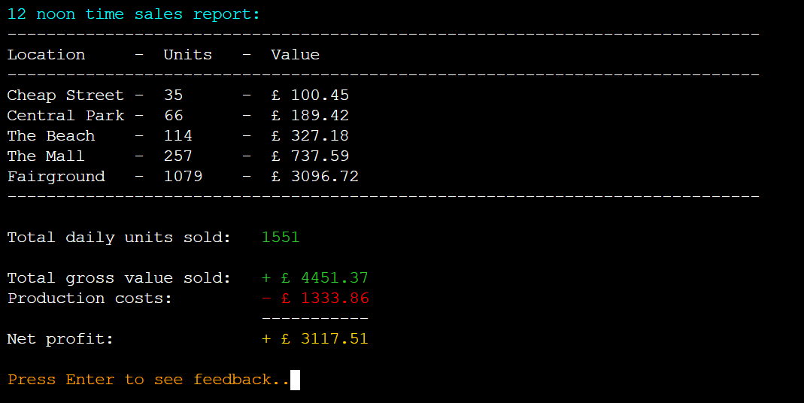
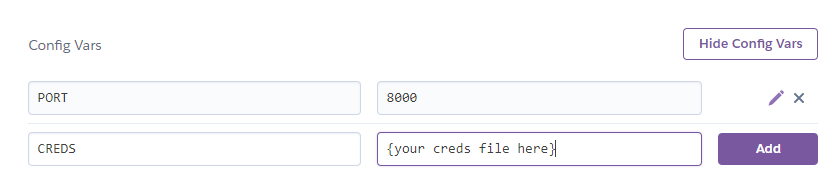

# Hotdog Empire Tycoon


## Live Site

[Hotdog Empire Tycoon](https://hotdog-empire-tycoon.herokuapp.com/)

## Repository

[https://github.com/BobWritesCode/ci-Project3](
  https://github.com/BobWritesCode/ci-Project3)

---
## Table of Contents

- [Hotdog Empire Tycoon](#hotdog-empire-tycoon)
  - [Live Site](#live-site)
  - [Repository](#repository)
  - [Table of Contents](#table-of-contents)
  - [Objective](#objective)
  - [Brief](#brief)
    - [Hotdog Empire Tycoon](#hotdog-empire-tycoon-1)
  - [UX &#8722; User Experience Design](#ux--user-experience-design)
    - [First Time User](#first-time-user)
    - [Returning User](#returning-user)
    - [Interested Party](#interested-party)
    - [Initial Concept](#initial-concept)
      - [Wireframes](#wireframes)
        - [Desktop](#desktop)
      - [Colour Scheme](#colour-scheme)
      - [Typography](#typography)
      - [Imagery](#imagery)
  - [Logic](#logic)
    - [Initial Flow](#initial-flow)
    - [Python Logic](#python-logic)
  - [Features](#features)
    - [Existing Features](#existing-features)
    - [Features Left to Implement](#features-left-to-implement)
  - [Data Model](#data-model)
  - [Technologies Used](#technologies-used)
    - [Python Packages](#python-packages)
    - [VS Code Extensions](#vs-code-extensions)
    - [Other Tech](#other-tech)
  - [Testing](#testing)
    - [Extensive Testing](#self-extensive-testing)
    - [Testers](#testers)
    - [PEP8 Testing](#pep8-testing)
  - [Bugs](#bugs)
    - [Current](#current)
    - [Resolved](#resolved)
  - [Development](#development)
    - [GitHub - Create new repository from template](#github---create-new-repository-from-template)
    - [GitHub - Cloning](#github---cloning)
    - [Google Sheets](#google-sheets)
      - [Creating Sheets](#creating-sheets)
    - [Google Sheets](#google-sheets)
      - [Creating Sheets](#creating-sheets)
    - [API Credentials](#api-credentials)
  - [Deployment](#deployment)
    - [Heroku](#heroku)
  - [Credits](#credits)
    - [Content](#content)
    - [Media](#media)
    - [Acknowledgements](#acknowledgements)

---

## Objective

Design an interactive game that uses an existing API for to save user game data and a leaderboard.
The project should run in a CLI, deployed via Heroku, using Python.

***The needs within this project are not genuine and are made purely
for the purpose of completing this project.***

---

## Brief

### Hotdog Empire Tycoon

The goal of this site is to provide an interactive game where the user / player can compete for a place on the leaderboard. The final product should:

- be programmatically error free,
- be written using Python,
- have replayability,
- handle all user input errors gracefully and appropriately,
- give clear instructions regarding use and valid inputs.
---

## UX &#8722; User Experience Design

Some example user stories which will affect the design

### First Time User

> *"As a person who like likes to play games, I would like something that provides some challenges but not overly difficult to learn."*
>
> *"As a competitive player, I would like to know how I compare with other users and go for top of a leaderboard."*
>
> *"As someone unfamiliar with tycoon game concept, I would like something that is to pick up and provides adequate direction."*

### Returning User

> *"As a returning user, I would like to see a list of current high-scores."*
>
> *"I would like to be able to continue a game where I left off."*
>
> *"I would the experience to be different each time I play."*

### Interested Party

> *"As someone interested in how the application has been made, I am interested to see how user inputs have been validated and errors have been handled"*
>
>*"As someone interested in how the application wasm, I am interested to see any interesting code you made have used or created."*

---

### Initial Concept

I intend to make a game application inspired by a childhood memory of Lemonade stand. The version I played was a flash game but learnt from starting this project that it all started with the [original created by Bob Jamison](https://en.wikipedia.org/wiki/Lemonade_Stand).

I intend to:
- use an API to store user game data, which the user can also use to retrieve a previous game they have not completed yet.
- use an API to store a leaderboard, which users will be able to view.
- write error proof logic.
- a fun and interesting game.

I do not intend:
- to store any user sensitive information using the API.

#### Wireframes

Due to the nature of this project the wireframes are very basic. There is only
one page and the design does not change across any devices, only a change in
content.

##### Desktop


---

#### Colour Scheme

I wanted to go for a vibrant eye-catching look. I also tried to keep to a colour theme as much as possible and not use too many colours.

- Cyan - Used mainly for headers.
- Pink - Used mainly for user tips.
- Orange - Used mainly for when user input was required.
- Red - Used mainly for errors and grabbing user attention.
- Yellow - Used mainly to highlight '0. Go Back' to the user
- Gold - Used mainly to highlight positive information to the user.
- Green - Used mainly for cash balance and some areas to help separate information from each other.

To create the different colour text in the game I used code found of [Grepper](https://www.codegrepper.com/code-examples/python/how+to+color+text+in+python+3).

```python
def coloured(r, g, b, text):
    return "\033[38;2;{};{};{}m{} \033[38;2;255;255;255m".format(r, g, b, text)
```

I then created specific colour functions to have better readability, keep colours uniformed and make it quicker to add coloured text.

```python
def pink(text):
    '''
    Changes to PINK if printed to terminal
    '''
    return coloured(255, 105, 180, text)
```

---

#### Typography

I do not use any external font outside the terminal except for the button provided by Code Institute to 'RUN PROGRAM'

---

#### Imagery

There is no imagery used for this project.

---

## Logic

### Initial Flow

This chart shows what the user will experience / see and is the concept of how the game will run


---

### Python Logic


---

## Features

### Existing Features

**Main Menu**

The main menu is the first screen a user will see, and give them 4 options to pink from:
- New game
- Load game
- View leaderboard 
- Credits


---
- **Setting up a new Game**

The user will need to provide a new name for their new hotdog empire. This must be from 5 and up to 20 characters.

```python
if len(user_name) < 5 or length > 20:
    print_error_message("Company name must be least 5 and no more "
                        + "than 20 characters")
    continue
```

After a game ID will be created and given to the player. This game ID is important as it will be how the user can retrieve their game save.

```python
while True:
    user_id = "".join(
        string.ascii_uppercase[random.randrange(0, 25)] for x in range(6)
        )
    user_data = SHEET.worksheet('user_data')
    cell_list = user_data.findall(user_id)
    if len(cell_list) == 0:
        break
```
After this the user will be given a short back story that is pulled from `constants.py`

---
**Game Menu**

The game menu is the main screen a user will interact with while playing the game. The user menu gives the player 9 options to pick from, including:
- Purchase location
- Purchase / upgrade cart(s)
- Hire / upgrade staff
- Purchase stock
- Change recipe
- Set selling prices
- Start trading
- Help
- Save and quit

This menu also provides valuable information to the player, so they don't have to unnecessarily go in and out of menu options to get this information.


---
- **Purchase locations**

Here the user can purchase locations they to sell at. Logic is in place so the user has to purchase each location in order.

```python
if (not stats['location'][str(user_choice)]['purchased']
        and purchase_loc_try(stats, int(user_choice))):
    remaining_cash = stats["cash"] - loc_cost[int(user_choice)-1]
elif not purchase_loc_try(stats, int(user_choice)):
    print_error_message('Can not make this purchase yet.')
    continue
else:
    print_error_message('Already Purchased.')
    continue
```


---
- **Purchase / upgrade carts**

Within this screen the user can purchase and upgrade carts. Logic is in place so the user can only purchase carts that they have already purchased the location for.

```python
# Make sure location has been purchased first.
if not stats['location'][str(result)]['purchased']:
    print_error_message("Purchase Land")
    continue

# Check if cart is not already at max level.
cart_level = stats['location'][str(result)]['cart_lvl']
if cart_level == 5:
    print_error_message("Already at max level.")
    continue
```


---
- **Hire / train staff**

This screen is very similar to purchase / upgrade carts with the same logic to check which options can be purchases and are currently upgradable.


---
- **Purchase stock**

The purchase stock screen has 2 stages. Firstly the main screen which shows the user information like how many ingredients they have in stock and how many products that makes based on their current recipe. At this stage the user can currently choose how many products they wish to have in stock ready to sell. If they input a number before the current stock level, logic will work out the amount of products need to be purchased and then show the user a checkout screen.

```python
def get_portions_available(stats):
    '''
    Return how many portions of hotdogs are available to sell
    based on current stock and recipe.
    '''
    # Max portions that can be sold in 1 part of the day
    max_por = 9999999
    # Find out which ingredient makes the least amount of hotdogs based
    # on recipe.
    for key in constants.STOCK_OPTIONS:
        if stats["recipe"][key] > 0:
            # How many hotdogs this ingredient will make
            ing_max = stats[key] / stats["recipe"][key]
            # Next, see if ing_max is smallest out of all ingredient, meaning
            # max hotdogs
            max_por = ing_max if ing_max < max_por else max_por

    return floor(max_por)
```


```python
# Header
print(f'\n{cyan("Checkout:")}')
print(constants.LINE)
print(f'{"Item:":<23}{"Qty:":<10}{"Portions:":<12}'
      + f'{"Sub total:":<10}')
print(constants.LINE)

# Basket
for count, key in enumerate(constants.STOCK_COSTS):
    text = (basket["portions"][count]
            * basket["total_qty_r"][count])
    text2 = basket["total_qty_c"][count]
    print(f'{constants.STOCK_COSTS[key][0]:<23}'
          + f'{basket["total_qty_r"][count]:<12}'
          + f'{text:<10}'
          + f'£{"{:.2f}".format(text2):<10}')
print(constants.LINE)

# Basket total
print('TOTAL COST: ' + green(f"£{'{:.2f}'.format(cost)}"))
```


---
- **Change recipe**

Within this screen the user can change how many ingredients are used to make each hotdog. It also displays the cost to make each hotdog based on recipe and current recommended retail price (RRP) (cost to make * 3 + 0.5). 


---
- **Set selling price**

This is simplest screen in the game. It quite simply allows the user to change the selling price of the product.


---
- **Help section**

To assist the user to understand how to play the game, I have provided this help section. Due to the large blocks of text I have stored them in `constant.py` to avoid blocking up the code in `game_menu.py`.

```python
# Part of help text from constants.py
HELP_SCREEN1 = f"""{cyan('Help:')}
{LINE}
{gold('Main Objective:')} Your main objective is to collect as much wealth
before the final day. At the end your wealth will determine your score.

{pink('Day cycle:')} Every day has 2 parts, morning and afternoon. The
morning starts at 8am and finishes at 12noon, you can do purchases in the
morning and afternoon. The afternoon is from 12noon to 5pm. The afternoon
is slightly longer.
```


---
- **Save and quit** and,
- **Auto save**

The game features a save functionality. The user can choose to save at the game menu or the game automatically save at the end each trading cycle, as well as one last time when the game is completed.

There were a couple obstacles to overcome with the save function. 

1) When saving using `gspread` it does not accept data in a dictionary format. So I had to convert a dictionary to a list. When searching for a solution I was unable myself to come across one. I had to write the code myself. I was able to do this with the solution below.\
\
Simply it takes the dictionary and goes through it key by key appending a blank table.\
\
If the next entry is a dictionary within the dictionary it sends that through a new thread of the function. And repeats that unto it reaches a non dictionary key.\
\
It then returns to the original thread and moves on to the next key.\
\
This repeated until the dictionary has been fully completed.

```python
def convert_dict_to_array(data, data_to_save):
    '''
    Convert dict game data to an array so it can be saved to Google Sheet
    '''
    for key in data:
        if isinstance(data[f'{key}'], dict):
            # If key is a dict then loop function
            convert_dict_to_array(data[f'{key}'], data_to_save)
        else:
            # If key is not a dict then append to table.
            data_to_save.append([data[f"{key}"]])

    return data_to_save
```

2) When saving to a worksheet using `gspread`, saving to a row you can just use a number. But saving to a column you have to use letter notation. I was going to write the code myself but then thought there is a chance someone else has already done this and I can find the code online, which I did.\
\
CREDIT : https://stackoverflow.com/questions/23861680/convert-spreadsheet-number-to-column-letter

```python
def save_loop(col, data, worksheet):
    '''
    Saves data[] to the correct row in Google.
    '''
    # Converts column number into letter notation used in spreadsheets
    # for columns. Example: 26 = Z, 27 = AA, 28 = AB...
    column_int = int(col)
    start_index = 1
    letter = ''
    while column_int > 25 + start_index:
        letter += chr(65 + int((column_int-start_index)/26) - 1)
        column_int = column_int - (int((column_int-start_index)/26))*26
    letter += chr(65 - start_index + (int(column_int)))

    # Creates string for cell notation for spreadsheet.
    s_col = f'user_data!{letter}1'

    # Saves data to worksheet
    SHEET.values_update(s_col,
                        params={'valueInputOption': 'RAW'},
                        body={'values': data})

    return True
```

---
- **Retrieve game**

As the game allows the user to save their game and provides then a Game ID. The user is able to retrieve their game providing it has not already been completed.

```python
# Cycle through row values until Game ID finds a match.
for count, key in enumerate(row_array):
    if key != user_input:
        continue

    # Copy data from column where Game ID found match.
    data = worksheet.col_values(count + 1)

    # Run function set_up_character()
    # Converts data retrieved from worksheet into data format
    # game uses.
    stats = set_up_character(data, False)
```


---
- **End Game Summary**

After the user has completed the game they are given a end game summary, as well as seeing if the made the leaderboard.


---
- **Being added to leaderboard**

At the end of the game. Logic will check to see if the player's score has made the top 10 of the leaderboard. If so add player into list where they have placed and remove the bottom player. Then save new leaderboard to the database.

```python
# Get current leaderboard information from Google worksheet.
highscore = SHEET.worksheet('leaderboard')
data = highscore.get_all_values()

# Go through current leaderboard entries and see if placed
# higher than any of the current entries.
for count, key in enumerate(data[1:10], 2):

    # Player has placed higher then a player.
    if stats["cash"] > float(key[1]):
        print(f"\n{green('CONGRATULATIONS!!!')}")
        print(f'You placed number {gold(count - 1)} on our '
              + 'leaderboard!\n')

        # Insert data of player into correct place
        data.insert(count - 1, [stats["name"], stats["cash"]])

        # Remove data for player who is no in 11th place.
        data.pop()

        # Update Google worksheet
        SHEET.values_update(
            'leaderboard!A1',
            params={'valueInputOption': 'RAW'},
            body={'values': data}
              )
```


---
- **View leaderboard**

Allows users to see leaderboard and provide a goal to aim for while playing the game. The scores are saved to a Google worksheet.

```python
# Get highscores from Google worksheet
highscore = SHEET.worksheet('leaderboard')
data = highscore.get_all_values()

# Header
print(f'{yellow("************************************")}')
print(f'{cyan("Top 10 highscores for classic mode")}')
print(f'{yellow("************************************")}\n')

# Show table headings
print(f"{data[0][0]:<20}{ data[0][1]:<20}")
print(constants.LINE)

# Show top 10 with scores
for key in data[1:10]:
    print(f"{key[0]:<20}{'£ ' +'{:.2f}'.format(float(key[1])):<20}")
```


---
- **View credits**

To pay homage to the original creator of the game that inspired this project and to also to the people who tested this game. I created a credits screen where I could show my appreciation.


---
- **Sales Report**

At the end of each trading session the user will get a report to show how well the day went. It nicely separates each locations performance, showing units sold and total net profit.

```python
  # Add up total values from different locations.
  total_sale_value = 0
  for i in data[3]:
      total_sale_value += i

  # Show sales report to user. Location, units sold, net profit.
  print(constants.LINE)
  print(f'{"Location":<13}{"-":<3}{"Units":<8}{"-":<3}{"Value (£)":<8}')
  print(constants.LINE)

  for count, key in enumerate(data[0]):
      print(f'{data[2][count]:<13}{"-":<3}'
            + f'{key:<8}{"-":<3}'
            + f'{floor(data[3][count]*100)/100:<8}')

  print(constants.LINE)
  
  # Totals
  print(f'Total daily units sold: {green(data[1])}')
  text = green(f'£{floor(total_sale_value*100)/100}')
  print(f'Total daily sales value: {text} (var +/- £0.01)')
  print('\nSales values are net profit (Sold price minus product cost).')
```



---
- **Feedback**

Based on the selling price and amount of ingredients used (to create value). Customers may think that the product is overpriced and decline to purchase. This section will let the user know, and if there is too much negative feedback for the user's liking they can make adjustments to their price and / or ingredients.

```python
# ((User selling price - optimal) / max increase) * 100
# less then X, customer will purchase. 
# Otherwise customer decline as overpriced.
max_markup = constants.MAX_PRICE_OVER_OPTIMAL
if goto_1 and (((price - osp) / max_markup)
                * 100 < randrange(100)):
    will_buy = True
elif goto_1:
    feedback["cost"][key] += 1
    rep_score -= 1
```


---
- **Reputation**

If the user has a day with little negative feedback vs sales made. Then their reputation will increase. If it's a bad day the reputation will decrease. Reputation provides bonuses to footfall, value and sales price.

```python
# If good score, increase reputation providing not already at max
if rep_percent > 0.5 and c_rep < 5:
    stats["reputation"] += 0.5
    print(
        f"{green('Reputation increase:')}\
            {gold('+ 0.5')}"
        )
elif rep_percent > 0.5 and c_rep == 5:
    print(gold("Reputation already at a 5!"))
```


---
- **Seamless transition back to menu**\
*(No random termination of program)*

It was very important to me that the user didn't reach the end of a function and the program just terminate. I spent time to make sure that as each function ended, it either had a `return` or I knew where it would go back to. An example of this is after the user completes the game. 

Once `end_game()` is completed it returns to `daily_menu()` then to either:
- `background_story()` > `new_game()` > `main_menu()`
- or straight to `main_menu()` if it was a previous game loaded. 

And `main_menu()` is in never ever `while True:` loop.

---
- **Continuous validation** and,
-  **Error Handling**

There are several areas within the game the user is required to p
input a string. Examples are: Choosing a name, navigating the menus, making changes to recipe.\
To make sure that there are no unexpected errors there are validation checks being done after the user provides their inputs and feeds back to the user if an error is detected.

```python
# Example of validation check when user is navigating the menus.
def validate_input(value, max_value):
    '''
    Inside the try, converts input string value into integer.
    Raises ValueError if strings cannot be converted into int,
    or if outside the expected range.
    '''
    try:
        try:
            int_value = int(value)
        except TypeError:
            print_error_message("Invalid input.")
            return False
        if int_value >= 0 and int_value <= int(max_value):
            return True
        raise ValueError()
    except ValueError:
        print_error_message("Invalid input.")
        return False
    return True
```

```python
    # Example of validation check when user is changing recipe

    # Get user input to change recipe
    result = input(f'\n{orange("Enter change i.e. 3 4: ")}')
    # Split string into a list
    result = result.split()

    # Validate user input
    if not validate_recipe_change(result):
        continue

def validate_recipe_change(data):
    '''
    Check user input for recipe change is valid
    '''
    if len(data) == 1 and data[0] == str(0):
        return True
    if len(data) != 2:
        print(f'{red("Check instructions and try again.")}')
        print_press_enter_to("Press Enter to continue...")
    else:
        if validate_input(data[0], 999) and validate_input(data[1], 999):
            return True
    return False
```


---

### Features Left to Implement

- Random Events

Part of my original plan I wanted to implement random events that could happen during trading. Example: Random hygiene inspection, or, influencer visits. And these events would have positive or negative results for sales performance that day.

- Different day challenged (short version of 5 days)

One of the testers mentioned she felt the game was a little too long. 

> *"This is amazing I haven't seen anything like it! My only issues is its a little long, so I’m getting impatient to reach the end! Such a great one!"*

This has given me the idea to implement a 5-day challenge for people who want to a quick blitz are the game.

---

## Data Model

A Google Sheet was used to store users game data. No sensitive data is store in the Google Sheet. The sheets consists of two worksheets, 'leaderboard' and 'user_data'.


---

## Technologies Used

### Python Packages

- `ascii_uppercase` from [string](https://docs.python.org/3/library/string.html): Used to create game id for user of 6 uppercase letters.

- [gspread](https://docs.gspread.org/en/latest/): Allows communication with Google Sheets.

- `floor` from [math](https://docs.python.org/3/library/math.html): Rounds down a float to an integer.

- `ceil` from [math](https://docs.python.org/3/library/math.html): Rounds up a float to an integer.

- `randrange` from [random](https://docs.python.org/3/library/random.html): Returns a random integer within a given range.

- `system` and `name` from [os](https://docs.python.org/3/library/os.html): Allows to clear the terminal.

---

### VS Code extensions

- [Python](https://marketplace.visualstudio.com/items?itemName=ms-python.python)

- [Beautify](https://open-vsx.gitpod.io/extension/HookyQR/beautify)

- [Auto Close Tag](https://open-vsx.gitpod.io/extension/formulahendry/auto-close-tag)

---
### Other Tech

- [Online Spellcheck](https://www.online-spellcheck.com/): To check spelling.

- [Balsamiq](https://balsamiq.com/wireframes/): To create wireframe.

- [Draw.io](https://app.diagrams.net/): To create flowcharts.

- [ShareX](https://getsharex.com/): Used to snip screenshots.

- [GitPod](https://gitpod.io/): Used as workspace and code editor.

- [Heroku](https://www.heroku.com/): Used to deploy project for live use.

- [Google Worksheet](https://www.google.co.uk/sheets/about/): Used as database.

---

## Testing

### Self Extensive Testing

Full manual testing can be found [here](TESTING.md) *(Caution: It's a big one!)*

### Testers

Prior to this final testing. I asked others to try out the game and see what errors they could find. Most reported everything ran smoothly and there were no unexpected errors but some formatting in places seemed off. All testers have been included within the Credits of the game and below in the credits section on this ReadMe.

> *"Hi. Just played your game 4 times, it's kinda addictive, unfortunately, it crashed once, and once the game did not save when accidentally going back into the menu. I'm not sure about the customer reviews and the formatting. I have attached a screenshot of the issue. My husband and I just spent over an hour playing this, so I would definitely say it's a job well done Wish you all the best!"*


- I as unable to replicated the error of not saving when going back to main menu. If it was an error it seems to now be fixed.
- I have fixed this so lines do not appear when a location does not have any feedback to show. [commit: 528da9a](https://github.com/BobWritesCode/ci-Project3/commit/528da9a3b20c670ba178267e174cdeb28089011b)

> *"This is amazing I haven't seen anything like it! My only issues is it's a little long, so I’m getting impatient to reach the end! Such a great one!"*

- I have suggested in my future ideas to implement, to include a shorter 5 day version of the game instead of the current 10.

> *"This is absolutely fantastic! What a project, I love it.
I got through the entire game, didn’t encounter any errors but did find a few typos I’ll add screen shots (so easy fixes). This is a colossal effort sir, well done indeed I made it to 4 on the leaderboard too."*

- Typos were corrected. They were mainly caused by strings that forced a line of code to be longer then 78 characters. And when I then split the line of code into two lines, I forgot to take into account and include a space.

```python
# Example of before - WRONG!
# No space after long
print('This is meant to be a very long'
      + 'string I need to split across two lines')

'Output: the words long string would be joined as 1: longstring'

# Example of after - CORRECT!
# Space included after long
print('This is meant to be a very long '
      + 'string I need to split across two lines')

'Output: the words long string would be separate: long string'
```

> *"It's so nice and slick and the user interface is epic. I don't have too much feedback other than it works perfectly! I didn't find it immediately obvious that the amount of ingredients being bought was the total amount (I thought that it was additional ingredients), but this is clearly user error and nothing wrong with the game. It could be worth making this a little more obvious to people like me who didn't quite get it, but that's just quality of life stuff/ dummy proofing. You should be really proud, your effort has totally paid off!"*

- Taking this feedback on board, I changed the purchase stock screen to try and make it more obvious what was actually happening. [commit: 5725551](https://github.com/BobWritesCode/ci-Project3/commit/5725551feec0405289676eadb18051c45e424841)

---
#### PEP8 Testing

The standard of testing [PEP8 Online](http://www.pep8online.com/) is currently down. So as a alternative option have installed a extension within VS Code to flag any errors.

1) Run the command pip3 install pycodestyle  Note that this extension may already be installed, in which case this command will do nothing.

2) In your workspace, press Ctrl+Shift+P (or Cmd+Shift+P on Mac).

3) Type the word linter into the search bar that appears, and click on Python: Select Linter from the filtered results.

4) Select pycodestyle from the list.

5) PEP8 errors will now be underlined in red, as well as being listed in the PROBLEMS tab beside your terminal.

Any styling errors would show up as a warning or critical error.\
In the image below I have highlighted a red rectangle around the results. Left to right you have critical errors, warnings and info. We do not have to worry about the info flags.
- There are 0 critical errors.
- The 3 warnings as are shown relate to .gitpod.yml. These warnings are related to the template files from Code Institute and do not reflect my coding.


---

## Bugs

### Current

I am unaware of any current unresolved bugs.

### Resolved

---
#### **Player got negative rep unintentionally**
[commit: b42ac68](https://github.com/BobWritesCode/ci-Project3/commit/b42ac6888bad7ec81c15ac594c7e462176dfcf1d)\
**What was meant to happy**: When a player does bad at sales and gets too much negative feedback, they would lose reputation.\
**What was actually happening**: When player was not receiving enough negative feedback their reputation score lowered.\
**Cause of problem**: The score range is from -1 (bad) to 1 (good). Where over 0.5 would give positive reputation and -0.5 would give negative. On the 3 lines of code I had forgot to make the bad score negative.
```python
# WRONG
elif rep_percent < 0.5:
elif rep_percent < 0.5 and c_rep > 0:
elif rep_percent < 0.5 and c_rep == 0:
```
**Solution**: Add minus before the 0.5s.
```python
# CORRECT
elif rep_percent < -0.5:
elif rep_percent < -0.5 and c_rep > 0:
elif rep_percent < -0.5 and c_rep == 0:
```

----
#### **Reputation changing by wrong amount**
[commit: 2e1434d](https://github.com/BobWritesCode/ci-Project3/commit/2e1434d41eca7bb3196f90a370affacbe8ac3c9b)\
**What was meant to happy**:\
When the players sales feedback was bad or good enough, they would get told their reputation was increase or decreased by 0.5.\
**What was actually happening**:\
Instead the player was being told their score was increasing or decreasing by whatever their current reputation actually was.\
**Cause of problem**:
```python
# WRONG
{gold('+' + str(stats['reputation']))}"
```
**Solution**:
```python
# CORRECT
{gold('+ 0.5')}"
```

---
#### **Division by 0 caused critical error**
[commit: 28d4a1c](https://github.com/BobWritesCode/ci-Project3/commit/28d4a1c5c2ba1742b6d4c5156e3b1971d4df25e0?diff=split)\
**What was meant to happy**:\
Player would get a hidden repscore based on the sales performance and this would be used to determine if the player's reputation went up or down.\
**What was actually happening**:\
When there were no 0 sales. There was a equation that tried to divide by 0 and cause a critical error and teh programme to terminate.\
**Cause of problem**:
```python
# WRONG
rep_percent = rep_score / sold
```
**Solution**:
```python
# CORRECT
rep_percent = (rep_score / opportunities) if opportunities != 0 else 0
```

---
#### **Calculation error when seeing if a customer would pay high price.**
[commit: 9027333](https://github.com/BobWritesCode/ci-Project3/commit/902733327e686175edc79df1654e700afe471bd9?diff=split)\
**What was meant to happy**:\
If was being sold higher then the customer would normally like to pay. There is essentially a random number generator to see if the customer would purchase.\
**What was actually happening**:\
No customer ever felt the product was overpriced.\
**Cause of problem**:\
The number to be compared would always be below 1.
```python
# WRONG
if goto_1 and (price - osp) / max_markup 
              < randrange(100):
    will_buy = True
```
**Solution**:\
Add multiply * 100 so the number would be between 0 and 100.
```python
# CORRECT
if goto_1 and (
              ((price - osp) / max_markup) * 100
              < randrange(100)):
    will_buy = True
```

---
#### **After game completed you are taken back to game menu oppose to intentional main menu.**
[commit: 76a61b5](https://github.com/BobWritesCode/ci-Project3/commit/76a61b506ea2e7bb2b419ae4415364f33ed4bbe5)\
**What was meant to happy**:\
When user reach end game, and finished the end game summary. The user was meant to be taken back main menu\
**What was actually happening**:\
User would be taken back to teh game menu.\
**Cause of problem**:\
The daily_menu() function would be called after the end_game function was over.
```python
# WRONG
elif user_choice == '7':
    result, stats = run_day(stats)
    if result:
        end_game(stats)
    daily_menu(stats)
```
**Solution**:\
Put the daily_menu() inside an else statement so only the end_game() or the daily_menu() would run, not both.
```python
# CORRECT
elif user_choice == '7':
    result, stats = run_day(stats)
    if result:
        end_game(stats)
    else:
        daily_menu(stats)
```

---
#### **New leaderboard entries overwriting old.**
[commit: bf89510](https://github.com/BobWritesCode/ci-Project3/commit/bf895102f08967ba7b16303115a260fd82875b15)\
**What was meant to happy**:\
IF a user scores high enough to secure a spot on the leaderboard of top 10 players. Then they would be inserted into teh correct position and other players moved down 1. With whoever is now 11th being deleted from the table.\
**What was actually happening**:\
Which ever place the player came 1st to 10th, they would just replace that player and the rest of the leaderboard would stay the same.\
**Cause of problem**:\
I used my save loop function but this would only replace the indicated row.
```python
# WRONG
data_to_save = [
    stats["name"],
    stats["cash"]
]
worksheet = SHEET.worksheet("leaderboard")
save_loop(row, data_to_save, len(data_to_save), worksheet)
```
**Solution**:\
Change the code to insert into the table, pop the last item of the list and just save without using the save_loop() function.
```python
# CORRECT
# Insert data of player into correct place
data.insert(count - 1, [stats["name"], stats["cash"]])
# Remove data for player who is no in 11th place.
data.pop()
# Update Google sheet
SHEET.values_update(
    'leaderboard!A1',
    params={'valueInputOption': 'RAW'},
    body={'values': data}
    )
```

---
#### **Player not added to top 10 if 10th place**
[commit: 90edeaa](https://github.com/BobWritesCode/ci-Project3/commit/90edeaaae6b0306b7cdd70bd4e1c366b7b07205f)\
**What was meant to happy**:\
If a player makes 10th on the leader they replace who is currently 10th and the previous person is removed from teh leaderboard as they would be 11th on a top 10.\
**What was actually happening**:\
If a player scored enough to be 10th, nothing would happen.\
**Cause of problem**:\
Simply, the code only looked at row 1-10, where in python the first in a list is 0. For the spread sheet first is 1, and row 1 in the spreadsheet is the headings. The code only therefore look at the top 9 places.
```python
# WRONG
for count, key in enumerate(data[1:10], 2):
```
**Solution**:\
Have the code look at one more row to consider 10th place.
```python
# CORRECT
for count, key in enumerate(data[1:11], 2):
```

---
#### **Stock purchase showing incorrect values**
[commit: 897097a](https://github.com/BobWritesCode/ci-Project3/commit/897097ac089d8f939f5738369e5bc375bd355d5b)\
**What was meant to happy**:\
The checkout basket would show quantity of items being purchased and also price, these .\
**What was actually happening**:\
The quantity and the price where always the same number.\
**Cause of problem**:\
A variable was declared and then immediately written over before being used.
```python
# WRONG
text = (basket["portions"][count]
        * basket["total_qty_r"][count])

text = basket["total_qty_c"][count]
```
**Solution**:\
Give variables 2 different names.
```python
# CORRECT
text = (basket["portions"][count]
        * basket["total_qty_r"][count])
text2 = basket["total_qty_c"][count]
```
---

#### **Multiple lines appearing after feedback**
[commit: ](https://github.com/BobWritesCode/ci-Project3/commit/528da9a3b20c670ba178267e174cdeb28089011b)\
**What was meant to happy**:\
If there was no negative feedback for a location, then no line should appear.\
**What was actually happening**:\
During the feedback regardless if a location had negative feedback or not a line appeared.\
**Cause of problem**:
The code below basically is, print a line except all but the first location. There was no check to make sure the location had negative feedback.
```python
# WRONG
if count[0] != 0:
    print(constants.LINE)
```
**Solution**:\
I added a variable called f_count. If there was any negative feedback to show f_count would go up by one and print a line where appropriate.
```python
# CORRECT
# Variable to count total feedback
t_count = 0

for count in enumerate(data[0]):
    f_count = 0
    for key in data[5]:
        if data[5][key][count[0]] > 0:

            if f_count == 0:
                text = data[2][count[0]]
                dash = "-"
                t_count += 1
            else:
                text = ""
                dash = ""
            if key == "value":
                text2 = f"{txt_decline} Add more ingredients."
            elif key == "cost":
                text2 = f"{txt_decline} Overpriced!"

            text3 = data[5][key][count[0]]
            print(f'{text:<13}{dash:<3}{text3:<7}{"-":<3}{text2:<13}')
            f_count += 1

    if f_count != 0:
        print(constants.LINE)
```
---

## Development

The site was made using [GitHub](#GitHub) and [GitPod](#GitPod)

### GitHub - Create new repository from template

[GitHub Website](https://github.com/)

Sign in to GitHub.

I used a template created by Code Institute that can be accessed [here](https://github.com/Code-Institute-Org/python-essentials-template) and is available for public use via the use this template button.

- Click '**Use this template**'.


- A new page will load.

- Give your project a name, 

- Provide a short description,

- Decide if it will e available publicly or private,

- There is no need to to tick 'Include all branches',

- Click 'Create repository from template'.


---

### GitHub - Cloning 

To clone using GitHib:

- Go to the project you wish to clone.

- Option 1:  If you have the [Google Chrome GitPod extension](https://chrome.google.com/webstore/detail/gitpod-always-ready-to-co/dodmmooeoklaejobgleioelladacbeki), you can just click on the Green GitPod button 

- Option 2: Click the 'Code' button. This open options for you to clone your preferred way.


### Google Sheets

#### Creating Sheets

This application uses **Google Sheets** to store data.

Assuming you have a Google account and are signed in you can go straight to your [Google Sheets here](https://docs.google.com/spreadsheets/u/0/).

Once you are on your Google Sheets dashboard you click the Google plus sign in the bottom right to create a new spreadsheet.


Once opened you can rename it by where it says 'Untitled spreadsheet' top right. Just click and give a new name.

**IMPORTANT:** The name used must match the name called in the open() method.

```python
SHEET = GSPREAD_CLIENT.open('Hotdog_Tycoon_Data')
```


Now make sure you have two tabs called 'leaderboard' and 'user_data'.
At the bottom of the page you will see a plus sign, a stack of lines, and a single tab named "Sheet1"
- Click the plus sign to create a 2nd tab called "Sheet2"
- Rename each tab by double clicking on its current name and name them 'leaderboard' and 'user_data'.


On the "leaderboard" tab in cells A1 and B1 input "Company" and "score"


**NOTE:** Google Sheets data works differently to most python objects. The 'list' of columns and rows starts at an index of 1.

---
### API Credentials
To allow access from the project to Google Sheets, credentials must be generated and provided.

Navigate to the [Google Cloud Platform](https://console.cloud.google.com/)

Click 'Select a project', this may have an existing project name in place.


Click 'NEW PROJECT'.


Give the project a name.


Click 'CREATE'.


From the project's dashboard, select 'APIs and services' and then 'Library'.


Search for, and enable, Google Drive API.


Click 'CREATE CREDENTIALS'.


Select 'Google Drive API' from the drop down list.


Select 'Application data' from the first set of radio buttons.


Select 'No, I', not using them' from the second set of radio buttons.


Click 'DONE' and then enter a name and description for the service account details.


Select a role of 'Editor' from the options available.


Click 'DONE' to create the service account.

Click on the service account on the credentials page.


Select 'KEYS' from the menu bar.


Select 'Create new key' from the 'ADD KEY' menu.


Select 'JSON' and click 'CREATE'.


The JSON file will be downloaded to your computer.

Copy the contents into a creds.json file within the repository. 

**EXTREMELY IMPORTANT:** Make sure to add this file to the .gitignore file. And do not share the contents of this file publicly.

---

## Deployment

---
### Heroku

Navigate to your heroku dashboard

Click "New" and select "Create new app".


Input a meaningful name for your app and choose the region best suited to your location.


Select "Settings" from the tabs.


Click "Reveal Config Vars".


Input PORT and 8000 as one config var and click add.

Input CREDS and the content of your Google Sheet API creds file as another config var and click add.



Click "Add buildpack".


Add "nodejs" and "python" from the list or search if necessary, remember to click save.


Python must be the first buildpack. They can be dragged into the correct position if needed.


Select "Deploy" from the tabs.


Select "GitHub - Connect to GitHub" from deployment methods.


Click "Connect to GitHub" in the created section.


Search for the GitHub repository by name.

Click to connect to the relevant repo.


Either click Enable Automatic Deploys for automatic deploys or Deploy Branch to deploy manually. Manually deployed branches will need re-deploying each time the repo is updated.


Click View to view the deployed site.\
*Note: It may take a moment to become available.*


---

## Credits

### Content

Unless specified all code written in the .py file was my own.

Repo python essentials template provided by: [Code Institute](https://codeinstitute.net/)

There were 2 blocks of code I did borrow for my project.

To provide coloured text: [Code Grepper](https://www.codegrepper.com/code-examples/python/how+to+color+text+in+python+3).
```python
def coloured(c_red, c_green, c_blue, text):
    '''
    Allows to change text colour
    '''
    return "\033[38;2;{};{};{}m{}\033[38;2;255;255;255m".format(
        c_red, c_green, c_blue, text
        )
```

And to save me time working out how to do it myself. I used Google to find this solution to turn columns numbers into spreadsheet notation letters.\
CREDIT:
[Sundar Nataraj on Stack Overflow](https://stackoverflow.com/questions/23861680/convert-spreadsheet-number-to-column-letter)
```python
  column_int = int(col)
  start_index = 1
  letter = ''
  while column_int > 25 + start_index:
      letter += chr(65 + int((column_int-start_index)/26) - 1)
      column_int = column_int - (int((column_int-start_index)/26))*26
  letter += chr(65 - start_index + (int(column_int)))
```

### Media

- [Hotdog image](https://www.clipartmax.com/middle/m2i8Z5N4N4G6K9i8_hot-dog-png-transparent-images-hot-dog-transparent-background/) used for Favicon.
- [favicon.io](https://favicon.io/favicon-converter/) used to convert image into Favicon.

### Acknowledgements

- [Code Institute](https://codeinstitute.net/) for teaching my the essentials of Python, as well as using Google API, and deployment on to Heroku.

- [Rahul L](https://github.com/rahulkp220) for being my mentor during this project. Rahul taught me about modulating my code.

All my testers!
- ArcAnum (Internet tester)
- Nick W (CI Student)
- Emily K (CI Student)
- Kristyna M (CI Student)
- Rachel O (CI Student)
- Kelly H (CI Student)

